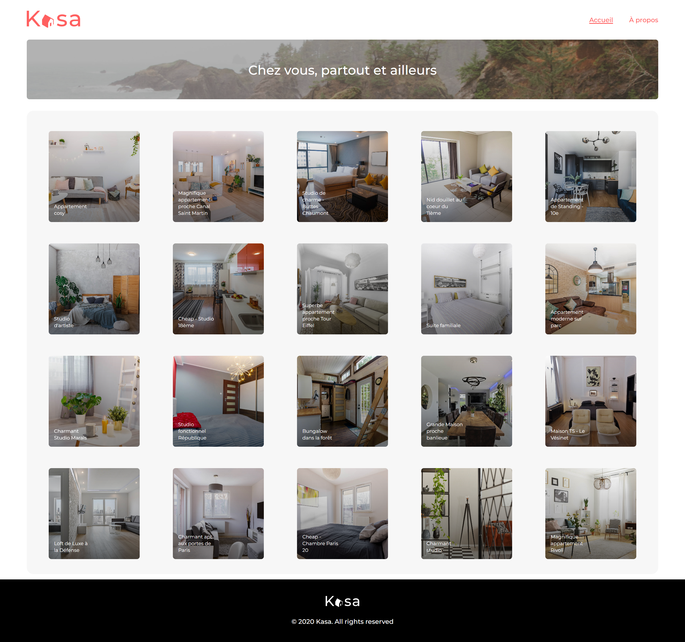
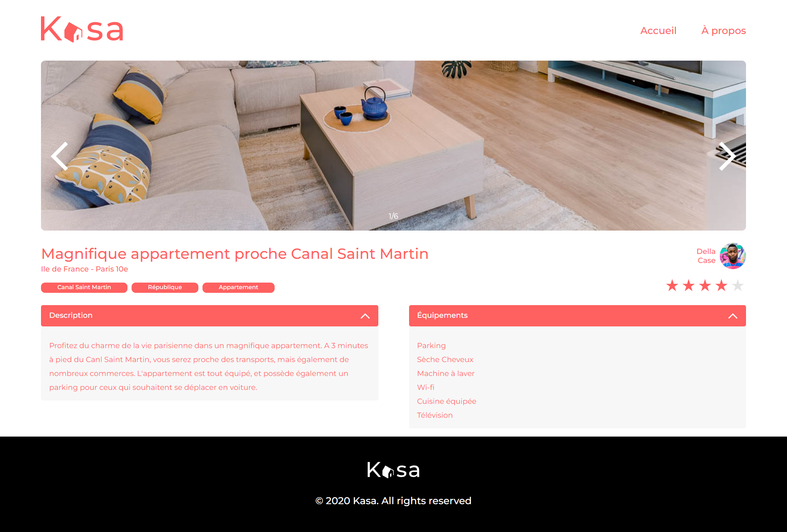

Project live at : https://anthony-chanty-kasa.vercel.app/

### `npm start`

Runs the app in the development mode.
Open [http://localhost:3000](http://localhost:3000) to view it in your browser.

The page will reload when you make changes.

## Table of contents

-  [Overview](#overview)
   -  [Screenshot](#screenshot)
   -  [Links](#links)
-  [My process](#my-process)
   -  [Built with](#built-with)
   -  [Useful resources](#useful-resources)
-  [Author](#author)

## Overview

### Screenshot

### Links

-  Live Site URL: https://anthony-chanty-kasa.vercel.app/
-  Local Site : use `npm start` and then open [http://localhost:3000](http://localhost:3000) to view it in your browser

## My process

### Built with

-  [React](https://reactjs.org/) - JS library
-  Semantic HTML5 markup
-  CSS custom properties
-  Sass preprocessor
-  Mobile-first workflow

## Author

-  Linkedin - [Anthony Chanty](https://www.linkedin.com/in/anthony-c-a925a6172/)
-  Frontend Mentor - [@achanty](https://www.frontendmentor.io/profile/AChanty)
